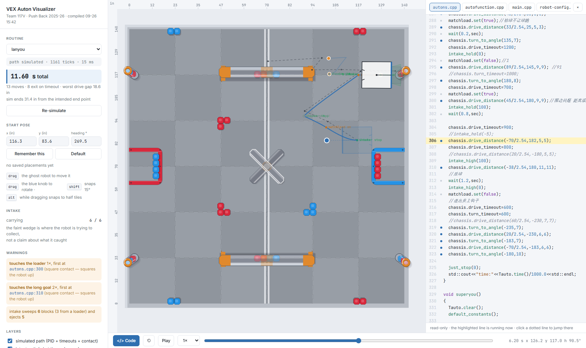
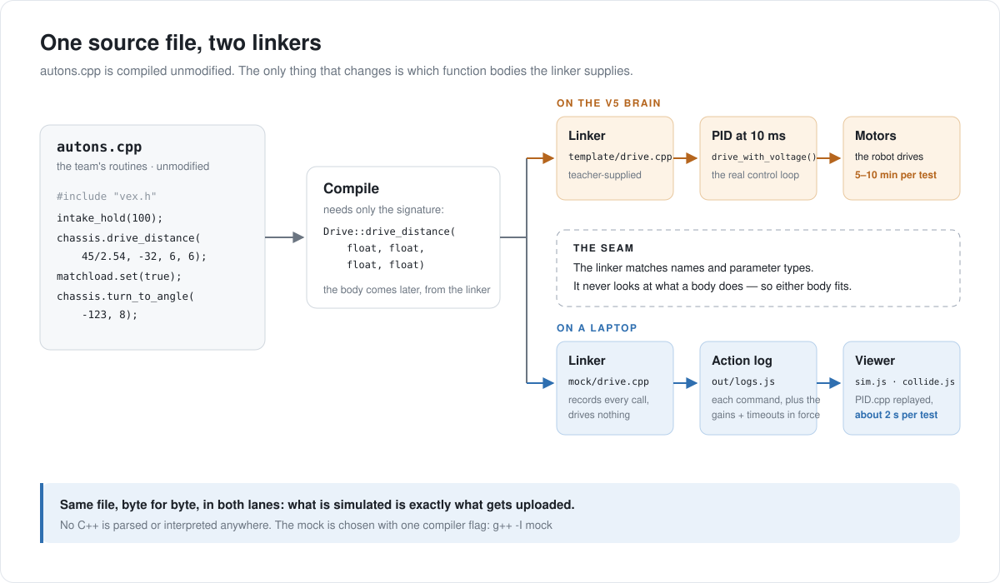

# VEX Auton Visualizer

**See where a VEX V5 autonomous routine will actually go — in about two seconds, without a field.**

It compiles a team's real, unmodified VEXcode project on a laptop, replays each autonomous routine through the robot's own PID control loop, and draws the result on a to-scale 2025–26 *Push Back* field: where each move really ends, which moves run out of time before they arrive, where the robot stops against a goal, which blocks the intake collects — and, for any moment on the timeline, which line of the team's code is running.

**[Open the live demo](https://rogercy-whoop.github.io/vex-auton-visualizer/)** — our routines, in the browser, nothing to install.

Built by VEX team **117V**, and designed so every team in our school's club can use it with their own robot and their own code.

**Status (27 Sep 2026): running on every team in SFLS's robotics club.** All four teams' VEXcode projects, from **117V**, **11117V**, **116X-323** and **3778W**, compiled and ran unchanged, with no change to the simulator needed for any of them. Each team has its own results packaged for it. The three newer robot profiles are provisional until those teams supply their measurements. See the [build log](docs/BUILD-LOG.md#27-sep--every-team-in-the-club).



---

## Why this exists

Testing one change to an autonomous routine used to cost 5–10 minutes: edit, compile, upload over USB, walk to the field, reset every block to its exact starting spot, walk back, run it, watch it fail. Most failures were trivial — a sign error sending the robot backwards, a heading typo, a distance that runs off the field.

Those are now caught in software, before anyone stands up.

It also answers a question the robot itself never could. Our drive loop's `settle_error` is 0, so **every `drive_distance` in our code exits on its timeout, not on arrival** — which means we never actually knew how far a given move got. The simulator runs the real control loop against the real timeouts and reports the gap, move by move.

---

## How it works



When the compiler builds `autons.cpp`, it only needs each function's **signature** — its name and parameter types. It leaves a placeholder for the call and trusts the **linker** to supply a body later. On the V5 brain the linker supplies the template's `drive.cpp`, which spins motors. On a laptop it supplies [`mock/drive.cpp`](mock/drive.cpp), which records the call instead. The team's code cannot tell the difference and is never edited.

So nothing parses or interprets C++. The file that gets simulated is, byte for byte, the file that gets uploaded.

**The seam is exactly three files wide.** The build compiles the team's whole project as written, swapping only `vex.h`, `auto-Template/drive.h` and `auto-Template/drive.cpp` for stand-ins. Everything else — routines, device configuration, `main.cpp`, the team's helpers, the rest of the template — is the team's real code. Two more things come straight from the compiler rather than from reading source:

- **Which routines exist, and what each device is called**, are read from the compiled object files' **symbol tables** with `nm`.
- **Which line made each move** is captured by a defaulted `std::source_location` parameter on every mock function. C++ fills default arguments in at the *call site*, so the mock learns the caller's file and line while the team's calls stay exactly as written.

The project is three layers, kept deliberately apart:

| Layer | Where | Job |
|---|---|---|
| **Recorder** | [`mock/`](mock/), [`harness/`](harness/) — C++ | Stand in for the VEX SDK. Record every command with the gains and timeouts in force, and the line that issued it. Drive nothing. |
| **Simulator** | [`viewer/sim.js`](viewer/sim.js), [`viewer/collide.js`](viewer/collide.js) | Replay the template's `PID.cpp` and move loops line for line at 10 ms, through a drivetrain model with three constants, on a field the robot cannot drive through. |
| **Viewer** | [`viewer/`](viewer/) | Draw it to scale from the official field drawings, with a timeline, the team's code, measuring tools and warnings. |

---

## What it shows

- **Two paths.** Dashed is what the code *says* — turn to h, go d. Solid is what the control loop *does* with the timeouts as written.
- **The code, running.** Open the code panel and the line executing at the current moment is highlighted as the timeline plays. Click a dotted line to jump to when it ran; click again for the next time. Every warning and every row of the moves table links to its line.
- **A moves table.** Every drive, turn and swing: what was asked for, what was achieved, the gap, the time taken, and whether it **settled** or hit its **timeout**.
- **Contact.** The robot stops against walls, goals and loaders, and its encoders stop with it — so a blocked drive burns its whole timeout going nowhere, as on the field. A square hit squares the robot up. An oblique hit is genuinely unpredictable, so the simulation **stops and says so** rather than drawing a confident wrong path.
- **Intake.** A faint capture wedge while collecting; blocks it passes over leave the field and count as carried. With the plate deployed against a loader, the stack is drawn down from the bottom and the rest fall.
- **Placement.** Drag and rotate the start pose anywhere, snap to half tiles or 15°, and save named placements per routine. The routines use gyro-relative headings, so the same code can be tried from any corner.
- **Measuring.** Edge rulers, a straight-edge to line the robot up against, and measurement lines in inches, tiles and bearing — in the robot's own heading convention, so a measured angle can be typed straight into `turn_to_angle()`.
- **A link to any view** — routine, placement, moment and open file — to send to a teammate.
- **Total time**, front and centre, against the 15 s autonomous period.

---

## Quick start (Windows)

1. Install [w64devkit](https://github.com/skeeto/w64devkit/releases) — a single zip, no installer.
2. Clone or download this repository.
3. Run:
   ```bat
   .\build.bat -DevKit "D:\path\to\w64devkit\bin"
   ```
   (`-DevKit` can be left off if w64devkit is unpacked at `D:\w64devkit`.)
4. Open [`viewer/index.html`](viewer/index.html). No server is needed.

To iterate, leave `.\watch.bat` running: edit and save in VEXcode, then press **F5**.

**For another team's robot:** `.\build.bat -Project "D:\path\to\their\project"`, with a filled-in [robot profile](profiles/README.md) in their project folder. The full guide — including how to build for a team without them installing anything — is in **[docs/FOR-TEAMS.md](docs/FOR-TEAMS.md)**.

---

## Where things are

```
build.bat, watch.bat   build once / rebuild on every save  (the work is in tools/)

mock/                  THE STAND-INS — the only files swapped out of a team's project
  vex.h                  the VEX SDK surface: motors, pneumatics, controller, tasks
  auto-Template/drive.h  the Drive class, same signatures as the template
  drive.cpp              the Drive bodies: record each move, drive nothing
  devices.cpp            what the fake devices do, and the simulated clock
  recorder.h, .cpp       the action log, each entry stamped with file and line
harness/
  main_sim.cpp           runs one routine in a fresh process, writes its log
  registry.h             what the build generates from the symbol tables
tools/
  build.ps1              stage, compile, read symbol tables, link, run, package
  watch.ps1              rebuild on save

viewer/                THE SIMULATOR AND VIEWER — open index.html
  robot.js               robot defaults; a team's profile is merged on top
  sim.js                 PID.cpp and the move loops, transcribed; the intake model
  collide.js             contact with walls, goals and loaders
  field.js               the Push Back field, from the official drawings
  viewer.js              camera, timeline, placement, code panel, tools, warnings

profiles/              robot profiles: ours, a template, and the field guide
out/                   our latest build: logs.js, source.js, profile.js
reference/             snapshot of our VEXcode project (see ATTRIBUTION.md)
docs/
  FOR-TEAMS.md           using it with another team's robot
  FINDINGS.md            what building this turned up about our code and the template
  BUILD-LOG.md           how it was built, with screenshots, in order
  architecture.svg       the diagram above
  media/                 screenshots
NOTES-future.md        what comes next, and what each item would need
```

---

## What it found

Building the simulator meant reading our control template line by line. The full write-up is in **[docs/FINDINGS.md](docs/FINDINGS.md)**; the headline items:

- **Every drive exits on timeout.** `drive_settle_error = 0` makes the settle branch of `PID::is_settled()` unreachable, so `drive_timeout` — not the distance argument — decides how far each move gets.
- **It could not have settled anyway.** The drive loop's integral is disabled and `kd = 0`, so it is pure proportional control, which has an unavoidable steady-state error.
- **That was a trade, not a bug.** Timeout-driven moves are inaccurate but repeatable, and they make the 15 s time budget exact. On a known field, that trade pays.
- **Turn radius has a closed form.** With both loops saturated, `R = track × drive_max_v / (2 × heading_max_v)` — the ratio we had been tuning by feel.
- **A blocked robot's encoders stop**, so its distance PID sees no progress and runs out its whole timeout.
- **A swing ignores its own voltage limit.** The template clamps swings with `turn_max_voltage`; the `swing_max_voltage` you set is never used.

---

## How it was checked, and what it does not claim

A simulator is only useful if it is honest about where it is guessing.

**What was checked.** The simulated routes for our routines were compared against how those routines ran on the field during the 2025–26 season, and they matched what we saw. Two calibrations come from observed behaviour: a capacity of six blocks and a loader rate of about 265 ms per block, both read off what `lanyou` is known to do (see [finding 12](docs/FINDINGS.md)). The software is regression-tested: the rebuilt recorder reproduces every routine's action count and duration exactly, and a routine run from 0° and from 90° gives paths that are exact rotations of each other.

**What was not.** The three drivetrain constants — load factor, response time and dead band — were never measured; they are estimates, with the dead band set to the value at which turns settle, as they do on the robot. So the *structure* of a result ("this drive times out", "this reverse move falls well short") is dependable, while exact inches are not. The Push Back field has since been taken down for the new season; calibration against a real field is the first item on the roadmap.

**What it does not claim.**

- **The intake model reports geometry, not success.** It says which blocks passed through the capture zone, not that the robot got them — approach angle and roller grip are not modelled. Its most useful output is the opposite: the wedge sweeping empty floor means the path missed.
- **Oblique impacts are not simulated past the impact.** The path ends there, with a warning.
- **Odometry-driven moves are not simulated.** A routine using `drive_to_point()` is shown up to that line.
- **Field positions are marked by confidence** in [`viewer/field.js`](viewer/field.js): confirmed against the drawing's tick marks, or placed from the official render.

---

## Authorship and credits

**I (Rogercy-whoop, team 117V) led this project.** I identified the problem and specified the architecture — a mock hardware layer at the linker seam, with no C++ parsing. I wrote every autonomous routine it simulates, along with our intake helpers and driver control. The findings about the control template began with my own line-by-line investigation of it, before this project started. The robot knowledge in the model is mine — dimensions, intake and plate geometry, the descore hook, loader contents — and I confirmed each calibration against how our robot actually behaves. I checked each stage against the robot and the official drawings, and caught the errors that mattered, including the heading-frame bug that made the simulated path diverge from the code.

**The code in `mock/`, `harness/`, `tools/` and `viewer/` was written with Claude, Anthropic's AI coding assistant, under my direction:** I set the requirements, and reviewed and corrected each stage. Later commits carry a `Co-Authored-By` trailer; the earliest commits were made the same way but predate it.

**The control template is not mine.** The files under `reference/…/auto-Template/` were supplied by our coach and closely resemble the public JAR Template. They are included so the stand-ins can be checked against the interface they imitate. [ATTRIBUTION.md](ATTRIBUTION.md) breaks this down file by file.

Field dimensions come from the public VEX 2025–26 V5RC *Push Back* field specification drawings; the field is drawn from those measurements, and no VEX artwork is redistributed.

---

## Roadmap

In order. Details, and what each item actually needs, are in [NOTES-future.md](NOTES-future.md). How it got here is in [docs/BUILD-LOG.md](docs/BUILD-LOG.md).

1. **Calibrate against a real field** — the three drivetrain constants and the intake rates.
2. **Edit in the browser.** Compile C++ in the page itself (clang built for WebAssembly), so a team can drop in their project, change a number, re-simulate and save it back to VEXcode — nothing to install at all.
3. **Scoring prediction**, from measured intake and alignment tolerances.
4. **Route optimisation**, using the calibrated simulator as the objective function.
5. **Odometry**, so routines using `drive_to_point()` can be simulated.
