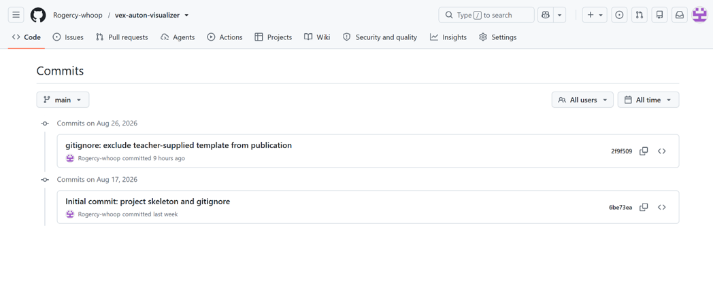
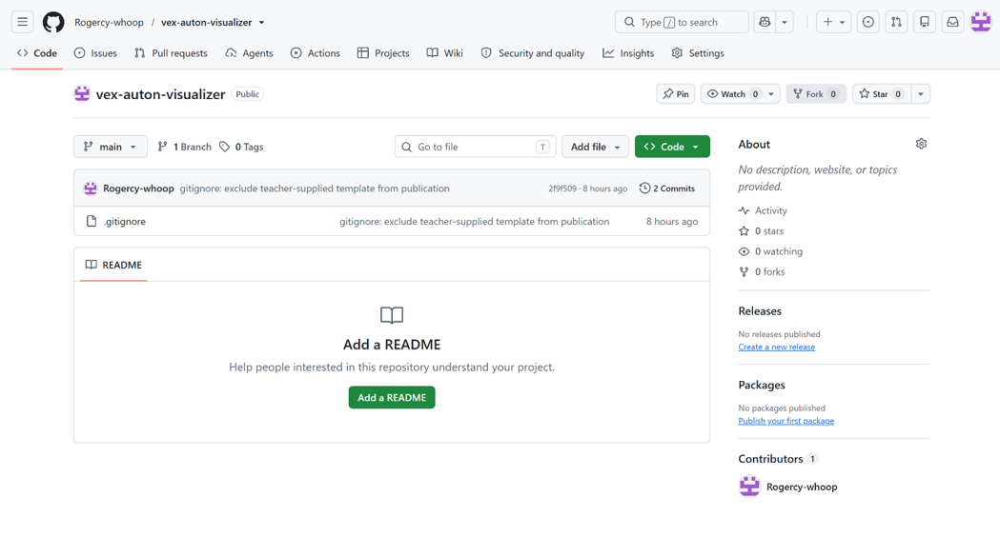
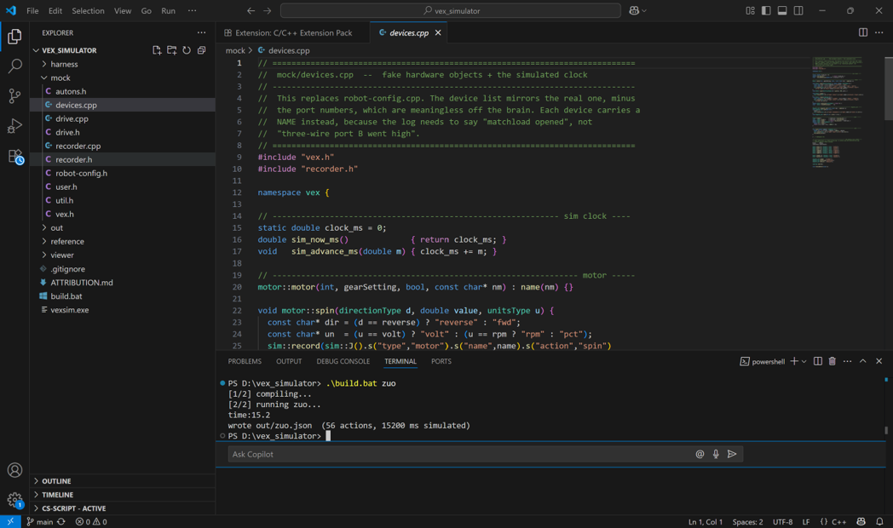
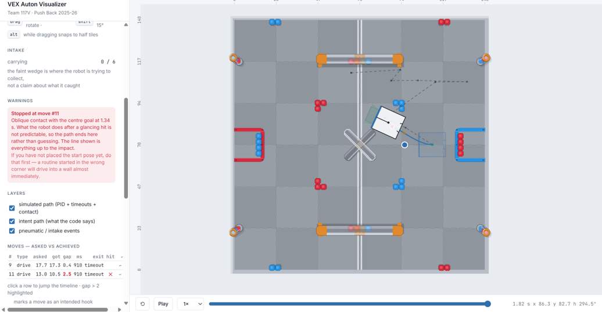
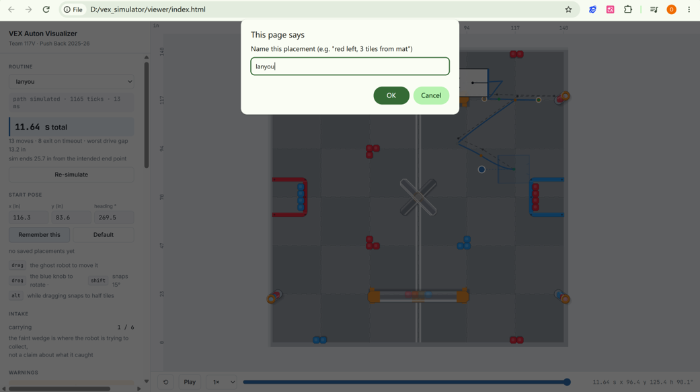
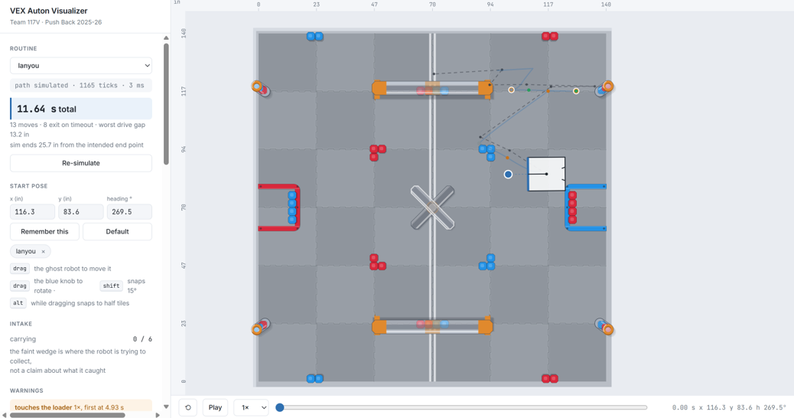

# Build log

How this project was built, in order, with the screenshots taken along the
way. Dates are the commit dates in this repository's history, which GitHub
shows under **Commits**.

---

## 17 Aug 2026 — the repository

The repository was created before any code, so the history would start at the
beginning. The first decision on record is in the second commit: the
teacher-supplied control template was excluded from publication until it was
clear how to credit it (it was later published with a file-by-file
[attribution](../ATTRIBUTION.md)).

---

## 26 Aug — the seam: unmodified code compiles on a laptop

The technically hardest step, and the least impressive-looking one. Our
`autons.cpp`, **unchanged**, compiled against a stand-in for the VEX SDK and ran
on a laptop. The `time:15.2` line is printed by our own code — a timing line we
wrote years ago for the robot's screen, now reporting simulated time.

The same day: the first drawing of the Push Back field, built from the official
field drawings rather than an image.

---

## 19 Sep — the control loop, collision, and the intake

The template's PID loop was transcribed line for line and run at 10 ms, so the
path shows what the robot *does* with the timeouts as written, not what the
code intends. Then collision: the robot can no longer drive through a goal,
and its encoders stop when it is blocked.

When the robot hits something at an angle, what happens next depends on
friction and on which corner caught — so the simulator stops there and says
so, rather than drawing a confident wrong path. Placed in the wrong corner,
`zuo` drives into the centre goal 1.34 s in.

A bug worth recording: after collision was added, the simulated path and the
intended path diverged by exactly the start orientation. The routines speak in
**gyro** headings, which read 0 wherever the robot was placed; the geometry
needs **field** headings. The fix converts between them in one place, and a
regression test now checks that a routine run from 0° and from 90° produces
paths that are exact rotations of each other.

Start placements can be named and saved per routine.

`lanyou` with its placement saved, before the code panel existed.

---

## 26 Sep — for every team in the club

- **Click a move, see its line of code.** Each recorded action now carries the
  file and line that made it, filled in by the compiler through a default
  argument. `autons.cpp` is still not edited.
- **Other teams' projects compile unchanged.** Only three files are swapped for
  stand-ins; routines and device names are read from the compiled object
  files' symbol tables. A team fills in a [robot profile](../profiles/README.md)
  and nothing else.
- README, the [architecture diagram](architecture.svg), and an accurate
  [attribution](../ATTRIBUTION.md).

---

## Videos

Screen recordings are too large to keep in the repository. They are linked
here instead:

- *(link)* — the old testing loop: edit, upload, walk to the field, reset every
  block, run, fail
- *(link)* — switching routines: the path drawing itself after each simulation
- *(link)* — dragging the start placement and watching the path recompute
- *(link)* — `lanyou` at the loader: the plate deploys, the stack is drawn down
  and falls, the count climbs to six
